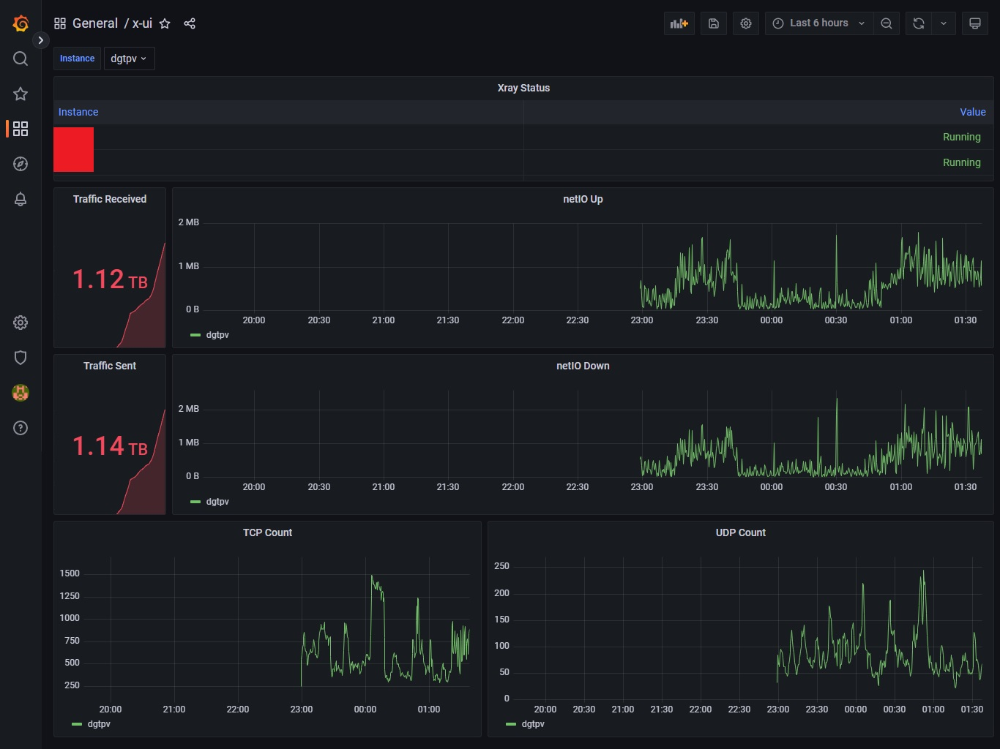

# x-ui Exporter
Prometheus exporter for [x-ui](https://github.com/vaxilu/x-ui)
On a HTTP `/metrics` request, the exporter will query the x-ui's API for data which it then aggregates and exposes as Prometheus metrics.

Docker container image: [https://hub.docker.com/r/aminaleahmad/x-ui-exporter](https://hub.docker.com/r/aminaleahmad/x-ui-exporter)

Default port: 9688

## Documentation
Run with docker-compose.yaml, make sure you set the `x_ui_url` and `x_ui_token` environment variables to your own desired variables,
`x_ui_token` can be obtained, from your browser's cookies after logging in.

## Grafana Dashboard Screenshots

